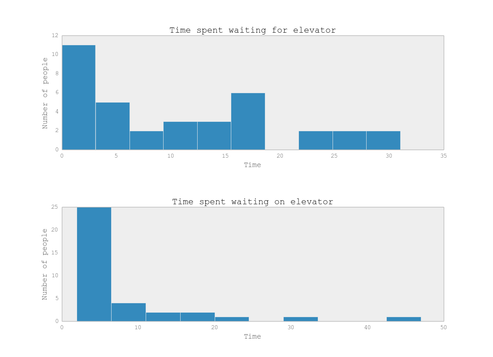

# The elevator problem

I've written a basic elevator and a complete simulator to go along with it. In the simulation, people are randomly
generated on each floor and each have a random floor to go to. The elevator tries to minimize the average wait time,
while also bounding the maximum wait time.

I've tested this on Python 2.7. To run,
```
python simulation.py --floors 50 --iterations 100 --max_new_people 3
```
A detailed description of each command line flag is given by
```
python simulation.py -h
```
You should see command line output like
```
Mean waiting for elevator time: 10.806
Mean waiting on elevator time : 7.333
Mean total wait time          : 18.139
```
If you have `matplotlib` installed, you should also see some plots giving more detailed statistics. For example,



`simulation.py` contains all of the simulation code, while `elevator.py` has the elevator business logic.

(sorry about the 8 space tabs - it's 4 spaces locally)
